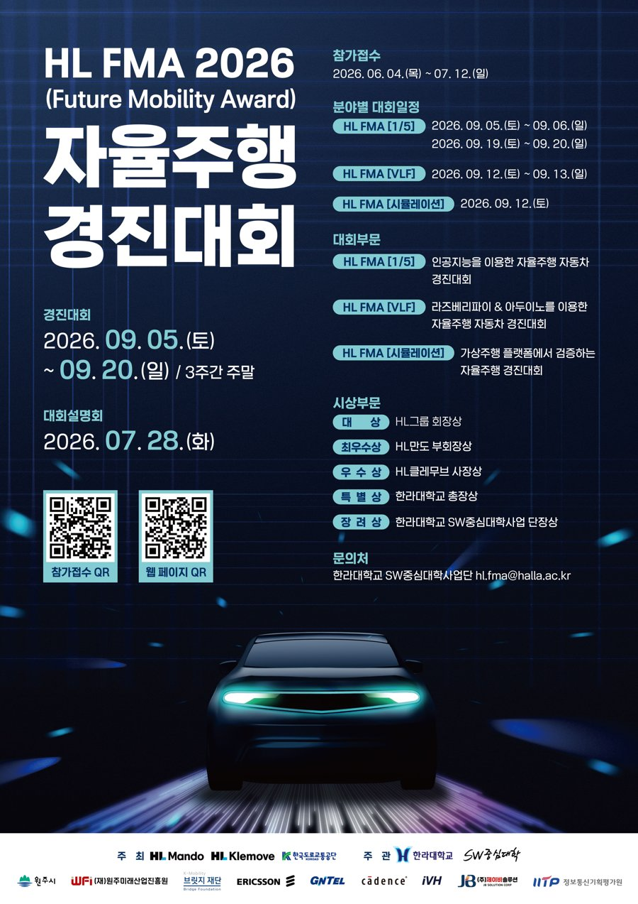

# HL FMA 2026 — 시뮬레이션 부문



**HL FMA 2026 (Future Mobility Award) 자율주행 경진대회 — HL FMA [시뮬레이션]**

- **일정**<br />사전 연동테스트 2026. 09. 03.(목), 본선 2026. 09. 12.(토)
- **장소**<br />원주미래산업진흥원
- **플랫폼**<br />VTD 2025.2 (Hexagon) 가상주행 환경, 화성 리빙랩(화성시청·남양) OpenDRIVE 맵
- **미션**<br />당일 공개되는 3 km 이내 도심 경로 완주. 신호교차로·횡단보도·어린이보호구역·터널·정지 차량·돌발 보행자 구간에서 도로교통법 준수 15개 항목을 구간별 감점제로 평가
- **주최·주관**<br />HL만도, HL클레무브, 한국도로교통공단 / 한라대학교 SW중심대학사업단 (협력 iVH, Cadence)

<br clear="right" />
<br />

<div align="center">
<table>
<tr>
<td align="center" valign="top" width="180">
  <a href="https://github.com/JaGyeong1024"></a><br />
  <a href="https://github.com/JaGyeong1024"><b>구자경</b></a>
</td>
<td align="center" valign="top" width="180">
  <a href="https://github.com/namgyu021210"></a><br />
  <a href="https://github.com/namgyu021210"><b>이남규</b></a>
</td>
<td align="center" valign="top" width="180">
  <a href="https://github.com/mini0909-web"></a><br />
  <a href="https://github.com/mini0909-web"><b>서민영</b></a>
</td>
</tr>
</table>
</div>

<br />

## 프로젝트 개요

- **차량**: 아이오닉 6 (VTD `HyundaiIoniq6_23_Dyn`)
- **입출력**: VTD TCP 9910 — 20 Hz로 자차 위치·주변 객체 30개·진행방향 신호 상태를 받고, 조향·가속·방향지시등 명령을 보냄
- **소프트웨어**: Ubuntu 24.04, ROS 2 Jazzy, Autoware

## 아키텍처

[Autoware](https://github.com/autowarefoundation/autoware) 기반. Sensing · Localization · Perception · Vehicle Interface 자리에
`vtd_autoware_bridge`, Map · Planning · Control · System은 Autoware.

| 서브시스템 | 구성 |
|---|---|
| Sensing · Localization | `vtd_autoware_bridge` — VTD 자차 위치 → `/localization/kinematic_state`, `/tf` |
| Perception | `vtd_autoware_bridge` — VTD 객체 → `/perception/object_recognition/objects`, VTD 신호 상태 → 신호등 |
| Map | Lanelet2 (`map/`, local 좌표 = VTD 월드 좌표) |
| Planning | Autoware |
| Control | Autoware (횡방향 MPC, 종방향 PID) |
| Vehicle Interface | `vtd_autoware_bridge` — `/control/command/control_cmd` → VTD 제어 패킷 |
| System · ADAPI | Autoware |

### vtd_autoware_bridge 노드

| 노드 | 역할 |
|---|---|
| `bridge_node` | VTD 패킷 → `/localization/*`, `/vehicle/status/*`, `/perception/object_recognition/objects`, 신호등. Autoware `control_cmd` → VTD 제어 패킷. 객체는 크기(L×W×H)로 차량·자전거·보행자를 분류하고, 신호 상태는 경로상 다음 정지선의 신호등 규제요소에 배정 |
| `route_node` | 대회 경로 CSV(`seq,x,y`)를 lanelet 중심선에 투영해 waypoint·goal로 주입하고 자율주행 전환까지 요청. 리스폰 시 지나온 점을 빼고 재주입 |
| `blocked_route_detour` | 정지 차량군에 막히기 전 감속하면서 Autoware 외부요청 차선변경(RTC)을 승인해 우회 |
| `pedestrian_proximity_slowdown` | 경로 좌우 10 m 안의 보행자·자전거에 대해 충돌 경로에 들어오기 전 예방 감속 (보호구역 별도 상한) |

## 구성

```
hlfma_ws/src/
  hlfma/                    팀 작성 패키지
    vtd_autoware_bridge/      VTD ↔ Autoware 브리지, 경로 주입, 우회·감속 노드 (+ pytest)
    autoware_launch/          런치·파라미터 (서브시스템·플래닝 모듈 구성)
    hlfma_vehicle_launch/     아이오닉 6 차량 제원 (vehicle_model:=hlfma_vehicle)
  autoware/                 Autoware 소스 (core · universe · launcher · sensor_component)
map/                        리빙랩 Lanelet2 맵 (local 좌표 = VTD 월드 좌표)
tools/                      회귀·계측·분석 도구
mock_vtd.py                 VTD 모의 서버 (시뮬 PC 없이 전체 스택 회귀)
start.sh / stop.sh / rviz.sh
```

### Autoware 소스

`hlfma_ws/src/autoware/` 중 업스트림과 다른 패키지:

- `autoware_behavior_path_lane_change_module`
- `autoware_behavior_path_static_obstacle_avoidance_module`
- `autoware_behavior_path_planner`, `autoware_behavior_path_planner_common`
- `autoware_motion_velocity_run_out_module`
- `autoware_route_handler`

## 빌드 및 실행

ROS 2 Jazzy와 Autoware 의존성(acados 포함)이 설치된 Ubuntu 24.04 기준입니다.

```bash
cd hlfma_ws
colcon build --symlink-install
```

VTD가 9910 포트를 열어 둔 상태에서 저장소 루트에서 실행합니다.

```bash
ROUTE_CSV=/path/to/route.csv ./start.sh          # 브리지 + Autoware 기동 → 경로 주입 → 자율주행 전환
./rviz.sh                                          # 별도 터미널 (선택)
./stop.sh                                          # 종료
```

| 실행 | 동작 |
|---|---|
| `./start.sh` | 실기 (VTD `192.168.50.11`) |
| `./start.sh <host>` | 다른 VTD 호스트 |
| `./start.sh mock` | 시뮬 PC 없이. 먼저 별도 터미널에서 `python3 mock_vtd.py` |
| `./start.sh psim` | Autoware planning simulator (브리지 없음, 맵·플래닝 확인용) |
| `ENGAGE=false ./start.sh` | 기동·경로 주입까지만, 출발은 수동 |

## 도구

| 도구 | 용도 |
|---|---|
| `tools/regress_mock.sh` | mock VTD + 브리지 + Autoware 전체 회귀 |
| `tools/harness/` | 수정 단위별 E2E 케이스 (정지·재출발, 우회, 차선변경, 리스폰) |
| `tools/check_route.py` | 경로 CSV가 맵 차선에 올바로 스냅되는지 점검 |
| `tools/check_topic_contract.sh` | 구독자만 있고 발행자가 없는 토픽 검출 (브리지 토픽 계약 점검) |
| `tools/run_rec.sh`, `tools/trace.py` | 실주행 녹화·계측 |
| `tools/score.py`, `tools/stop_analysis.py` | 주행 기록 자동 채점, 적색 정지 접근 분석 |
| `tools/xodr_map.py`, `tools/lane_graph.py` | OpenDRIVE 파서, 차선 그래프 |

## License

`hlfma_ws/src/autoware/`는 [Autoware](https://github.com/autowarefoundation/autoware)
소스로 각 패키지의 라이선스(대부분 Apache License 2.0)를 따릅니다.
`hlfma_ws/src/hlfma/autoware_launch`, `hlfma_vehicle_launch`는 Autoware의 `autoware_launch`,
`sample_vehicle_launch`를 기반으로 수정한 것입니다.
